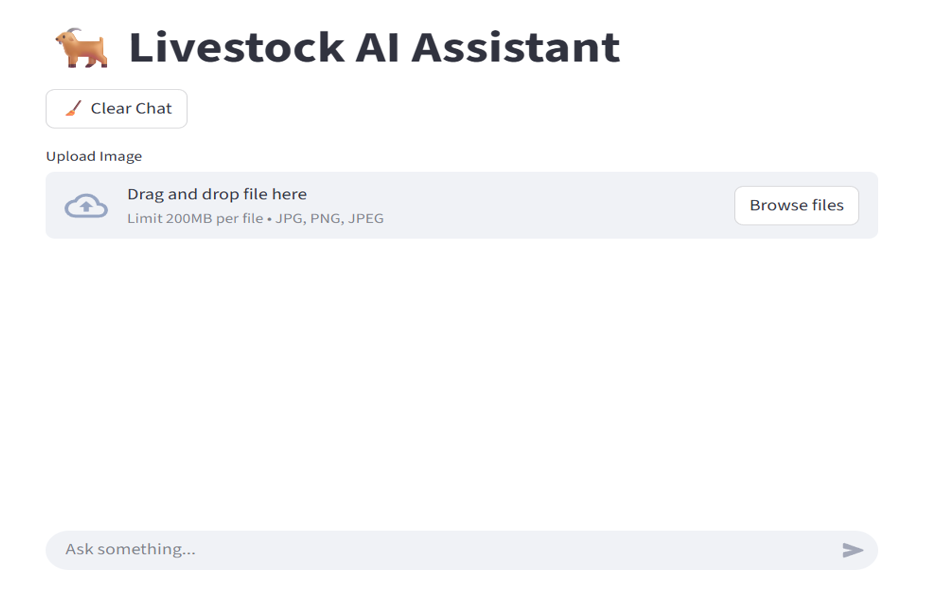
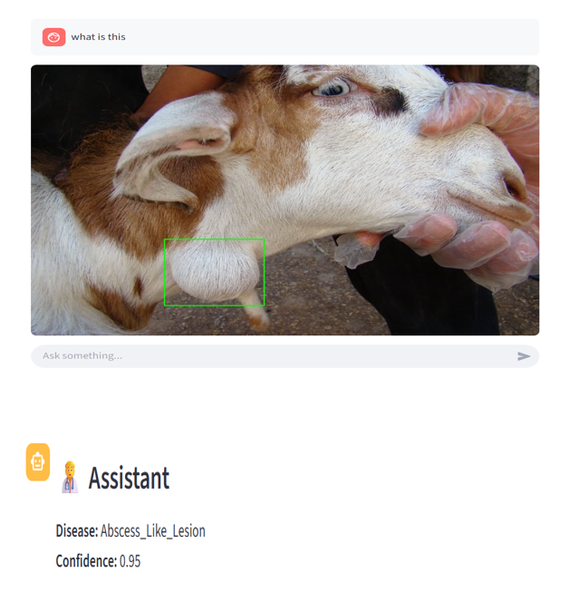
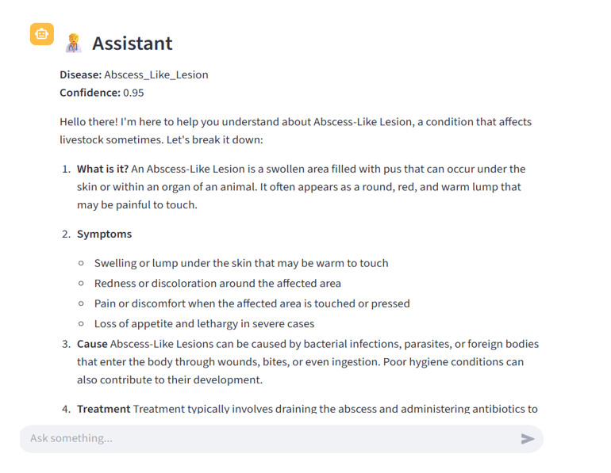
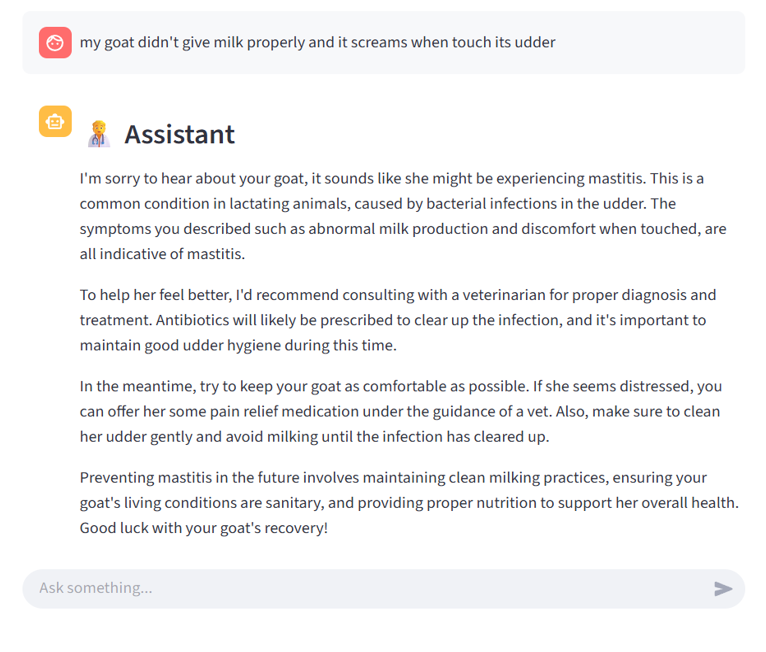

# Livestock AI Assistant – Goat Disease Detection & Advisory System

## Overview

Livestock AI Assistant is an intelligent system designed to help farmers detect goat diseases using image analysis and provide AI-powered advisory support.
It combines **Computer Vision (CNN + YOLO)** with **Retrieval-Augmented Generation (RAG)** to deliver accurate and actionable insights.

---

## Key Features

* Image-based disease detection
* Lesion detection using YOLO (bounding box visualization)
* AI-powered advisory (symptoms, causes, treatment)
* Natural language interaction (chat interface)
* Knowledge retrieval using FAISS + Sentence Transformers
* Real-time predictions with confidence score

---

## Tech Stack

* **Python**
* **TensorFlow / Keras** (CNN Model)
* **YOLOv8 (Ultralytics)** (Lesion Detection)
* **FastAPI** (Backend API)
* **Streamlit** (Frontend UI)
* **Sentence Transformers (MiniLM)** (Embeddings)
* **Flowise** (LLM)
* **FAISS** (Vector Search)

---

## System Architecture

User Input (Image / Text)
→ Streamlit UI (`app.py`)
→ FastAPI Backend (`vision_api.py`)
→ CNN + YOLO Models
→ RAG Engine (FAISS + LLM)
→ Response to User

---

## Demo

### User Interface



### Image Upload & Lesion Detection



### Disease Prediction



### AI Advisory Response



---

## How to Run

### 1️ Clone Repository

```bash
git clone https://github.com/kanigashree152003/Livestock-AI.git
cd Livestock-AI
```

### 2️ Install Dependencies

```bash
pip install -r requirements.txt
```

### 3️ Run Backend

```bash
python backend/vision_api.py
```

### 4️ Run Frontend

```bash
streamlit run frontend/app.py
```

### 5️ Open in Browser

```
http://localhost:8501
```

---

##  Model Details

* **CNN Model** → Goat disease classification
* **YOLO Model** → Lesion detection (bounding boxes)
* **RAG System** → FAISS + Sentence Transformers + LLM
* **Output** → Disease name + Confidence + Advisory

---

## Dataset

* Custom dataset of goat disease images
* Knowledge base includes symptoms, causes, and treatments

  Dataset and trained models are not included due to size constraints.

---

## Note

* This project runs locally
* Backend must be running before using the UI
* Intended for **educational and support purposes only**, not a replacement for veterinary diagnosis

---

## Future Improvements

* Mobile application
* Multilingual support (Tamil + English)
* More disease categories
* Cloud deployment

---

## Author

**Kanigashree R**
MSc Data Analytics

---


